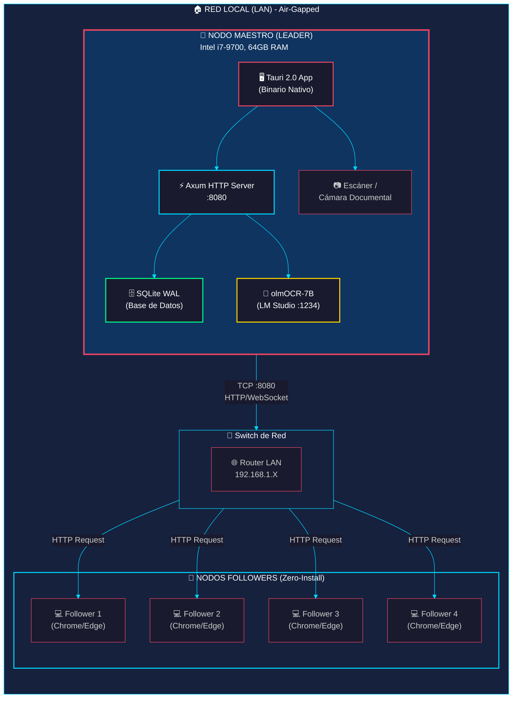
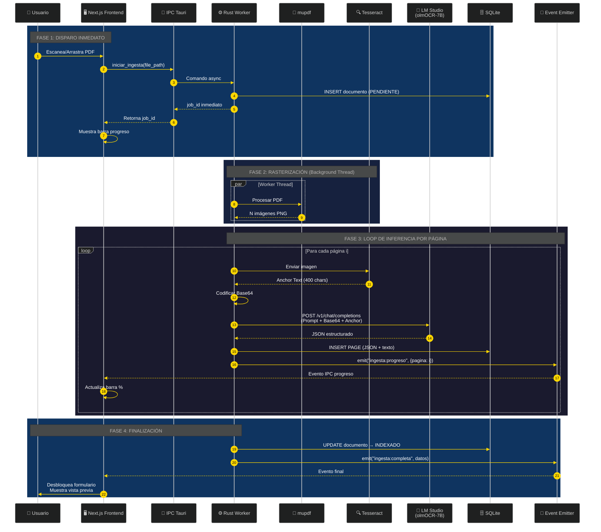
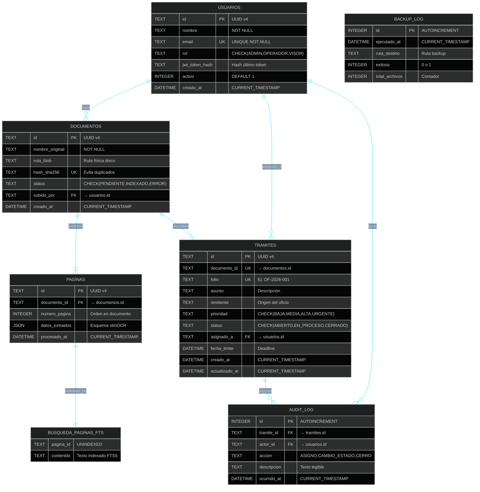
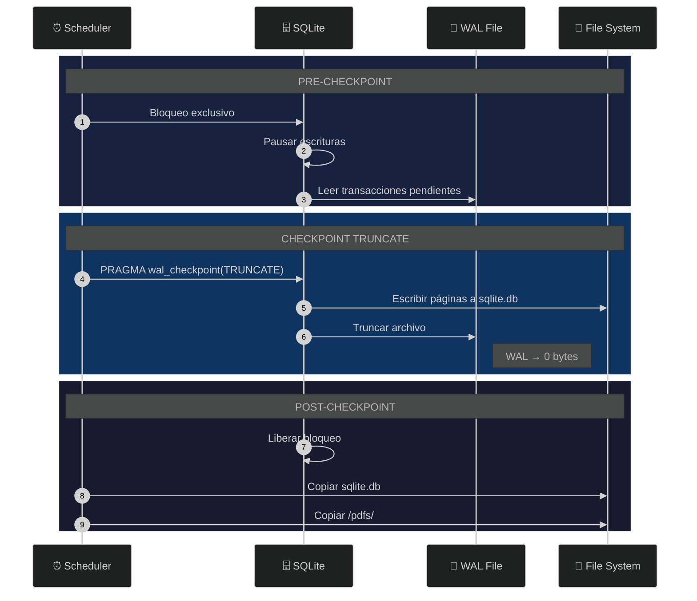
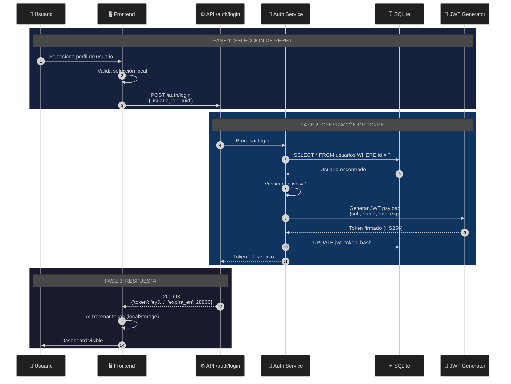
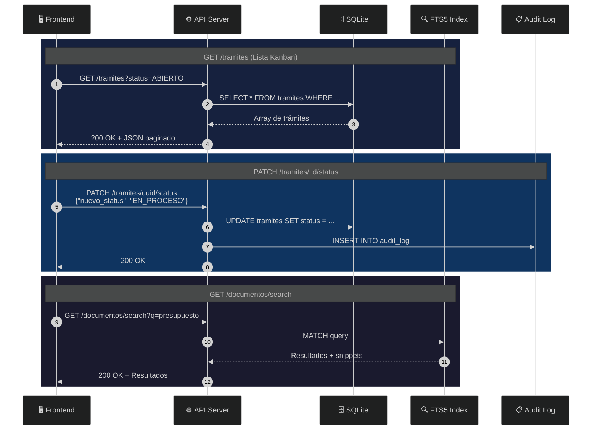
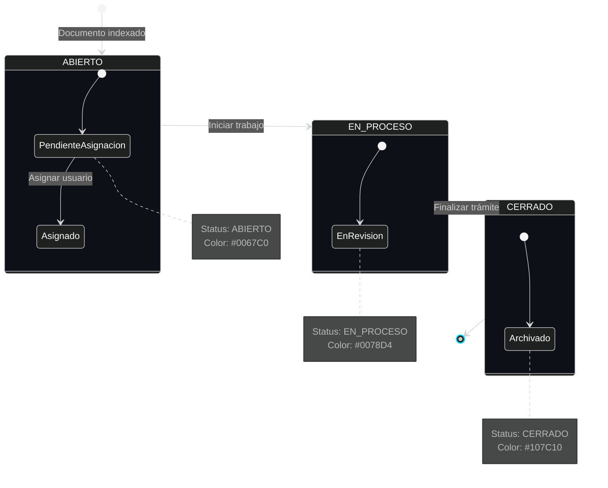
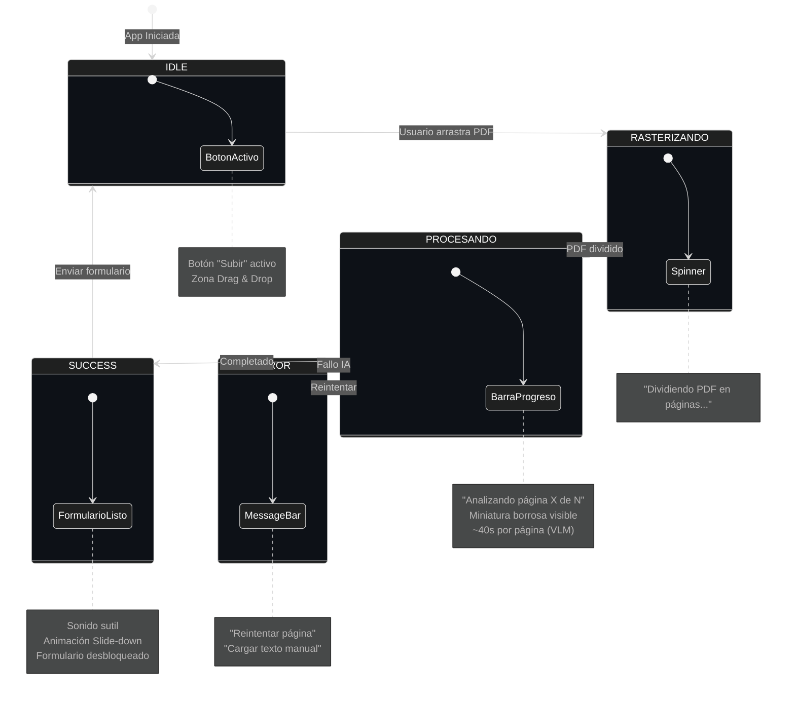

<div align="center">

# 🏛️ Sistema BPM/ECM Local-First

### Diagramas de Arquitectura - Documentación Visual Completa

**Sistema de Inteligencia Documental y Gestión de Flujos de Trabajo**

[](https://mermaid.js.org/)
[](https://c4model.com/)
[]()

---

**Proyecto:** Air-Gapped | Intel i7-9700 | 64GB RAM | 5 Usuarios

</div>

---

## 📑 Tabla de Contenidos

| Sección                                                              | Descripción                              | Diagramas   |
| -------------------------------------------------------------------- | ---------------------------------------- | ----------- |
| [1. Arquitectura del Sistema (ADD)](#1-arquitectura-del-sistema-add) | Topología, Stack, Pipeline, Concurrencia | 7 diagramas |
| [2. Diseño de Base de Datos (DDL)](#2-diseño-de-base-de-datos-ddl)   | ERD, FTS5, Backup                        | 3 diagramas |
| [3. API REST (API_Spec)](#3-api-rest-api_spec)                       | Endpoints, Auth, Trámites, Streaming     | 4 diagramas |
| [4. Interfaz de Usuario (UI-UX)](#4-interfaz-de-usuario-ui-ux)       | Estados, Navegación, Visor               | 4 diagramas |

---

<div align="center">

## 🎨 Leyenda de Colores

| Color |    Hex    | Significado                        |
| :---: | :-------: | ---------------------------------- |
|  🔴   | `#e94560` | Componentes críticos / Nodo Leader |
|  🔵   | `#00d9ff` | Red, comunicación, flujos          |
|  🟢   | `#00ff88` | Persistencia, éxito, datos         |
|  🟡   | `#ffd700` | IA, alertas, recursos              |
|  ⚪   | `#0078D4` | Acciones primarias, UI             |

</div>

---

<br>

# 1. Arquitectura del Sistema (ADD)

> Documento de Diseño de Arquitectura - Especificación Técnica Maestra

## 1.1 Topología de Red (Leader-Zero-Install Followers)


```mermaid
%%{init: {
  'theme': 'dark',
  'themeVariables': {
    'primaryColor': '#1a1a2e',
    'primaryTextColor': '#ffffff',
    'primaryBorderColor': '#e94560',
    'lineColor': '#00d9ff',
    'secondaryColor': '#16213e',
    'tertiaryColor': '#0f3460',
    'background': '#0d1117',
    'mainBkg': '#1a1a2e',
    'nodeBorder': '#e94560',
    'clusterBkg': '#16213e',
    'clusterBorder': '#00d9ff',
    'titleColor': '#ffffff',
    'edgeLabelBackground': '#1a1a2e'
  },
  'flowchart': {
    'curve': 'basis',
    'padding': 20,
    'nodeSpacing': 50,
    'rankSpacing': 80
  }
}}%%
flowchart TB
    subgraph LAN["🏠 RED LOCAL (LAN) - Air-Gapped"]
        direction TB

        subgraph LEADER["🎯 NODO MAESTRO (LEADER)<br/>Intel i7-9700, 64GB RAM"]
            direction TB
            TAURI["🖥️ Tauri 2.0 App<br/>(Binario Nativo)"]
            AXUM["⚡ Axum HTTP Server<br/>:8080"]
            SQLITE["🗄️ SQLite WAL<br/>(Base de Datos)"]
            VLM["🧠 olmOCR-7B<br/>(LM Studio :1234)"]
            SCANNER["📷 Escáner /<br/>Cámara Documental"]

            TAURI --> AXUM
            AXUM --> SQLITE
            AXUM --> VLM
            TAURI --> SCANNER
        end

        subgraph SWITCH["🔀 Switch de Red"]
            ROUTER["🌐 Router LAN<br/>192.168.1.X"]
        end

        subgraph FOLLOWERS["👥 NODOS FOLLOWERS (Zero-Install)"]
            direction LR
            F1["💻 Follower 1<br/>(Chrome/Edge)"]
            F2["💻 Follower 2<br/>(Chrome/Edge)"]
            F3["💻 Follower 3<br/>(Chrome/Edge)"]
            F4["💻 Follower 4<br/>(Chrome/Edge)"]
        end

        LEADER -->|"TCP :8080<br/>HTTP/WebSocket"| SWITCH
        SWITCH -->|"HTTP Request"| F1
        SWITCH -->|"HTTP Request"| F2
        SWITCH -->|"HTTP Request"| F3
        SWITCH -->|"HTTP Request"| F4
    end

    style LEADER fill:#0f3460,stroke:#e94560,stroke-width:3px,color:#fff
    style FOLLOWERS fill:#16213e,stroke:#00d9ff,stroke-width:2px,color:#fff
    style TAURI fill:#1a1a2e,stroke:#e94560,stroke-width:2px,color:#fff
    style AXUM fill:#1a1a2e,stroke:#00d9ff,stroke-width:2px,color:#fff
    style SQLITE fill:#1a1a2e,stroke:#00ff88,stroke-width:2px,color:#fff
    style VLM fill:#1a1a2e,stroke:#ffd700,stroke-width:2px,color:#fff
    style SWITCH fill:#16213e,stroke:#00d9ff,stroke-width:1px,color:#fff
```

### Componentes del Nodo Maestro


```mermaid
%%{init: {
  'theme': 'dark',
  'themeVariables': {
    'primaryColor': '#1a1a2e',
    'primaryTextColor': '#ffffff',
    'primaryBorderColor': '#e94560',
    'lineColor': '#00d9ff',
    'secondaryColor': '#16213e',
    'tertiaryColor': '#0f3460',
    'background': '#0d1117'
  }
}}%%
flowchart TB
    subgraph LEADER_INTERNAL["🎯 NODO MAESTRO - Arquitectura Interna"]
        direction TB

        subgraph SHELL["🖥️ SHELL (Tauri 2.0)"]
            direction LR
            BINARY["Binario Nativo<br/>(Rust + WebView)"]
            IPC["IPC Bridge<br/>(Commands + Events)"]
            HW["Hardware Access<br/>(v4l2/DirectShow)"]
        end

        subgraph SERVER["⚙️ SERVIDOR HTTP"]
            direction LR
            AXUM_S["Axum + Tokio<br/>(Async Runtime)"]
            JWT["JWT Middleware"]
            ROUTES["API Routes"]
            STATIC["Static Files<br/>(Next.js SSG)"]
        end

        subgraph AI["🧠 INTELIGENCIA ARTIFICIAL"]
            direction LR
            MU["mupdf<br/>(PDF Rasterization)"]
            TESS["Tesseract<br/>(OCR Anchor)"]
            OLM["olmOCR-7B Q8_0<br/>(LM Studio)"]
        end

        subgraph DATA["💾 DATOS"]
            direction LR
            DB["SQLite WAL"]
            FTS["FTS5 Index"]
            BLOB["Blob Storage<br/>(PDFs)"]
        end
    end

    SHELL --> SERVER
    SERVER --> AI
    SERVER --> DATA
    AI --> DATA

    style LEADER_INTERNAL fill:#0f3460,stroke:#e94560,stroke-width:2px
    style SHELL fill:#16213e,stroke:#e94560,stroke-width:1px
    style SERVER fill:#1a1a2e,stroke:#00d9ff,stroke-width:1px
    style AI fill:#16213e,stroke:#ffd700,stroke-width:1px
    style DATA fill:#1a1a2e,stroke:#00ff88,stroke-width:1px
```

---

## 1.2 Stack Tecnológico por Capas


```mermaid
%%{init: {
  'theme': 'dark',
  'themeVariables': {
    'primaryColor': '#1a1a2e',
    'primaryTextColor': '#ffffff',
    'primaryBorderColor': '#e94560',
    'lineColor': '#00d9ff',
    'secondaryColor': '#16213e',
    'tertiaryColor': '#0f3460',
    'background': '#0d1117'
  }
}}%%
flowchart TB
    subgraph LAYERS["🏗️ PILA TECNOLÓGICA COMPLETA"]
        direction TB

        subgraph SHELL["🖥️ CAPA 1: Shell Desktop (Leader)"]
            TAURI2["<b>Tauri 2.0 + Rust</b><br/>Binario nativo mínimo<br/>Acceso hardware v4l2/DirectShow"]
        end

        subgraph FRONTEND["🎨 CAPA 2: Frontend UI/UX"]
            NEXT["<b>Next.js (SSG)</b><br/>Interfaz reactiva compilada"]
            FLUENT["<b>Fluent UI v9</b><br/>Estética WinUI 3 / Mica"]
        end

        subgraph BACKEND["⚙️ CAPA 3: Servidor Integrado"]
            AXUM_S["<b>Axum + Tokio</b><br/>HTTP async embebido"]
            JWT["<b>JWT Middleware</b><br/>Autenticación perimetral"]
        end

        subgraph AI["🧠 CAPA 4: Inteligencia Artificial"]
            direction LR
            MUPDF["<b>mupdf + Tesseract</b><br/>Rasterización PDF<br/>OCR de anclaje"]
            OLM["<b>olmOCR-7B Q8_0</b><br/>LM Studio GGUF<br/>Inferencia CPU pura"]
        end

        subgraph DATA["💾 CAPA 5: Persistencia"]
            SQL["<b>SQLite (WAL)</b><br/>Base de datos embebida"]
            FTS["<b>FTS5</b><br/>Búsqueda texto completo"]
        end
    end

    SHELL --> FRONTEND
    FRONTEND --> BACKEND
    BACKEND --> AI
    BACKEND --> DATA
    AI --> DATA

    style LAYERS fill:#0f3460,stroke:#e94560,stroke-width:2px
    style SHELL fill:#16213e,stroke:#e94560,stroke-width:2px
    style FRONTEND fill:#1a1a2e,stroke:#00d9ff,stroke-width:2px
    style BACKEND fill:#16213e,stroke:#00ff88,stroke-width:2px
    style AI fill:#1a1a2e,stroke:#ffd700,stroke-width:2px
    style DATA fill:#16213e,stroke:#00ff88,stroke-width:2px
```

| Capa                    | Tecnología                 | Versión   | Justificación                             |
| ----------------------- | -------------------------- | --------- | ----------------------------------------- |
| **Shell Desktop**       | Tauri 2.0 + Rust           | 2.0       | Binario <10MB, acceso nativo hardware     |
| **Frontend**            | Next.js SSG + Fluent UI v9 | 14.x / v9 | Sin servidor Node, estética WinUI 3       |
| **Backend**             | Axum + Tokio               | 0.7 / 1.x | Async puro, sin bloqueos I/O              |
| **IA Preprocesamiento** | mupdf + Tesseract          | 1.23      | Rasterización PDF, OCR anclaje            |
| **IA Inferencia**       | olmOCR-7B Q8_0             | -         | CPU-only, 64GB RAM suficiente             |
| **Persistencia**        | SQLite WAL + FTS5          | 3.45+     | Un proceso escritor, búsqueda instantánea |

---

## 1.3 Pipeline de Ingesta Documental


```mermaid
%%{init: {
  'theme': 'dark',
  'themeVariables': {
    'primaryColor': '#1a1a2e',
    'primaryTextColor': '#ffffff',
    'primaryBorderColor': '#e94560',
    'lineColor': '#00d9ff',
    'secondaryColor': '#16213e',
    'tertiaryColor': '#0f3460',
    'background': '#0d1117',
    'signalColor': '#ffd700',
    'signalTextColor': '#ffffff'
  }
}}%%
sequenceDiagram
    autonumber
    participant U as 👤 Usuario
    participant UI as 🖥️ Next.js Frontend
    participant IPC as 📡 IPC Tauri
    participant RUST as ⚙️ Rust Worker
    participant MU as 📄 mupdf
    participant TESS as 🔍 Tesseract
    participant LM as 🧠 LM Studio<br/>(olmOCR-7B)
    participant DB as 🗄️ SQLite
    participant EVT as 📢 Event Emitter

    rect rgb(15, 52, 96)
        Note over U,UI: FASE 1: DISPARO INMEDIATO
        U->>UI: Escanea/Arrastra PDF
        UI->>IPC: iniciar_ingesta(file_path)
        IPC->>RUST: Comando async
        RUST->>DB: INSERT documento (PENDIENTE)
        RUST-->>IPC: job_id inmediato
        IPC-->>UI: Retorna job_id
        UI->>UI: Muestra barra progreso
    end

    rect rgb(22, 33, 62)
        Note over RUST,TESS: FASE 2: RASTERIZACIÓN (Background Thread)
        par Worker Thread
            RUST->>MU: Procesar PDF
            MU-->>RUST: N imágenes PNG
        end
    end

    rect rgb(26, 26, 46)
        Note over RUST,EVT: FASE 3: LOOP DE INFERENCIA POR PÁGINA
        loop Para cada página i
            RUST->>TESS: Enviar imagen
            TESS-->>RUST: Anchor Text (400 chars)
            RUST->>RUST: Codificar Base64
            RUST->>LM: POST /v1/chat/completions<br/>(Prompt + Base64 + Anchor)
            LM-->>RUST: JSON estructurado
            RUST->>DB: INSERT PAGE (JSON + texto)
            RUST->>EVT: emit("ingesta:progreso", {pagina: i})
            EVT-->>UI: Evento IPC progreso
            UI->>UI: Actualiza barra %
        end
    end

    rect rgb(15, 52, 96)
        Note over RUST,U: FASE 4: FINALIZACIÓN
        RUST->>DB: UPDATE documento → INDEXADO
        RUST->>EVT: emit("ingesta:completa", datos)
        EVT-->>UI: Evento final
        UI->>U: Desbloquea formulario<br/>Muestra vista previa
    end
```

### Métricas de Rendimiento del Pipeline

| Métrica                | Valor           | Nota                        |
| ---------------------- | --------------- | --------------------------- |
| **Rasterización**      | ~1s por PDF     | Variable según páginas      |
| **OCR Tesseract**      | ~2s por página  | CPU-bound                   |
| **Inferencia VLM**     | ~40s por página | Cuello de botella principal |
| **Total (10 páginas)** | ~7-8 minutos    | Proceso en background       |
| **RAM por inferencia** | ~4GB            | olmOCR-7B Q8_0              |

---

## 1.4 Arquitectura de Concurrencia SQLite


```mermaid
%%{init: {
  'theme': 'dark',
  'themeVariables': {
    'primaryColor': '#1a1a2e',
    'primaryTextColor': '#ffffff',
    'primaryBorderColor': '#e94560',
    'lineColor': '#00d9ff',
    'secondaryColor': '#16213e',
    'tertiaryColor': '#0f3460',
    'background': '#0d1117'
  }
}}%%
flowchart TB
    subgraph SYSTEM["⚡ SISTEMA DE CONCURRENCIA SQLITE"]
        direction TB

        subgraph SOURCES["📥 FUENTES DE OPERACIONES"]
            direction LR
            API["🌐 API REST<br/>(Axum Routes)"]
            WORKER["🤖 AI Worker Pool<br/>(Ingesta)"]
            FRONTEND["🖥️ Frontend Queries<br/>(Next.js)"]
        end

        subgraph READ["📖 POOL DE LECTURA (Async)"]
            direction TB
            RP["SqlitePool<br/>max_connections: 8"]
            R1["SELECT Query 1"]
            R2["SELECT Query 2"]
            R3["SELECT Query N"]
            RP --> R1
            RP --> R2
            RP --> R3
        end

        subgraph WRITE["✏️ CANAL DE ESCRITURA (Serializado)"]
            direction TB
            CH["mpsc::channel<br/>(Cola FIFO)"]
            W1["INSERT/UPDATE 1"]
            W2["INSERT/UPDATE 2"]
            W3["INSERT/UPDATE N"]
            CH --> W1 --> W2 --> W3
        end

        subgraph DB["🗄️ SQLITE (WAL Mode)"]
            direction TB
            WAL["📝 Write-Ahead Log"]
            DBMAIN["💾 Database Main"]
            CHECK["🔄 Checkpoint<br/>(03:00 AM)"]
            WAL --> DBMAIN
            DBMAIN --> CHECK
        end
    end

    API -->|"SELECT"| READ
    FRONTEND -->|"SELECT"| READ
    WORKER -->|"INSERT/UPDATE"| WRITE

    READ -->|"Concurrente"| DB
    WRITE -->|"Serializado"| WAL

    style SYSTEM fill:#0f3460,stroke:#e94560,stroke-width:2px
    style READ fill:#0f3460,stroke:#00ff88,stroke-width:2px
    style WRITE fill:#0f3460,stroke:#e94560,stroke-width:2px
    style DB fill:#16213e,stroke:#00d9ff,stroke-width:2px
    style SOURCES fill:#1a1a2e,stroke:#ffd700,stroke-width:1px
```

### Configuración de Pragmas

```sql
PRAGMA journal_mode = WAL;      -- Write-Ahead Logging
PRAGMA synchronous = NORMAL;    -- Optimización escrituras
PRAGMA foreign_keys = ON;       -- Integridad referencial
PRAGMA busy_timeout = 5000;     -- Espera 5s antes de fallar
```

---

## 1.5 Gestión de Recursos CPU (Intel i7-9700)


```mermaid
%%{init: {
  'theme': 'dark',
  'themeVariables': {
    'primaryColor': '#1a1a2e',
    'primaryTextColor': '#ffffff',
    'primaryBorderColor': '#e94560',
    'lineColor': '#00d9ff',
    'secondaryColor': '#16213e',
    'tertiaryColor': '#0f3460',
    'background': '#0d1117'
  }
}}%%
flowchart TB
    subgraph CPU["🖥️ Intel i7-9700 (8 Cores / 8 Threads)"]
        direction TB

        subgraph CORES["🔩 DISTRIBUCIÓN DE NÚCLEOS"]
            direction LR

            subgraph VLMCORES["🧠 VLM Engine (4 Threads)"]
                direction LR
                C0["Core 0"]
                C1["Core 1"]
                C2["Core 2"]
                C3["Core 3"]
            end

            subgraph SYSCORES["⚙️ Sistema + Runtime (4 Threads)"]
                direction LR
                C4["Core 4<br/>Tokio Runtime"]
                C5["Core 5<br/>SQLite Pool"]
                C6["Core 6<br/>OS/Network"]
                C7["Core 7<br/>UI Graphics"]
            end
        end

        subgraph PROCESSES["📊 PROCESOS ACTIVOS"]
            direction LR

            subgraph HEAVY["🏋️ INTENSIVO"]
                LM["🧠 LM Studio<br/>--threads 4<br/>(olmOCR-7B Q8_0)"]
                TESS["🔍 Tesseract OCR<br/>(Subproceso)"]
            end

            subgraph LIGHT["⚡ REACTIVO"]
                TOKIO["⚡ Tokio Async<br/>(HTTP + IPC)"]
                SQLS["🗄️ SQLite Pool<br/>(8 conexiones)"]
                TAURI["🖥️ Tauri WebView<br/>(Frontend)"]
            end
        end
    end

    VLMCORES --> HEAVY
    SYSCORES --> LIGHT

    style CPU fill:#0f3460,stroke:#e94560,stroke-width:2px
    style VLMCORES fill:#0f3460,stroke:#e94560,stroke-width:2px
    style SYSCORES fill:#16213e,stroke:#00ff88,stroke-width:2px
    style HEAVY fill:#1a1a2e,stroke:#ffd700,stroke-width:2px
    style LIGHT fill:#1a1a2e,stroke:#00d9ff,stroke-width:2px
    style C0 fill:#e94560,stroke:#e94560,stroke-width:1px,color:#fff
    style C1 fill:#e94560,stroke:#e94560,stroke-width:1px,color:#fff
    style C2 fill:#e94560,stroke:#e94560,stroke-width:1px,color:#fff
    style C3 fill:#e94560,stroke:#e94560,stroke-width:1px,color:#fff
    style C4 fill:#00ff88,stroke:#00ff88,stroke-width:1px,color:#000
    style C5 fill:#00ff88,stroke:#00ff88,stroke-width:1px,color:#000
    style C6 fill:#00ff88,stroke:#00ff88,stroke-width:1px,color:#000
    style C7 fill:#00ff88,stroke:#00ff88,stroke-width:1px,color:#000
```

### Métricas con Aislamiento vs Sin Aislamiento

| Métrica            | Sin Aislamiento    | Con Aislamiento        |
| ------------------ | ------------------ | ---------------------- |
| **UI FPS**         | ~5 fps (congelada) | 60 fps (fluida)        |
| **API Latency**    | >5s (timeout)      | <100ms                 |
| **Inferencia/pág** | ~35s               | ~40s (ligero overhead) |
| **Experiencia**    | Inusable           | Profesional            |

---

## 1.6 Estrategia de Disaster Recovery


```mermaid
%%{init: {
  'theme': 'dark',
  'themeVariables': {
    'primaryColor': '#1a1a2e',
    'primaryTextColor': '#ffffff',
    'primaryBorderColor': '#e94560',
    'lineColor': '#00d9ff',
    'secondaryColor': '#16213e',
    'tertiaryColor': '#0f3460',
    'background': '#0d1117'
  }
}}%%
flowchart TB
    subgraph DR["🛟 DISASTER RECOVERY (03:00 AM Daily)"]
        direction TB

        subgraph TRIGGER["⏰ DISPARADOR"]
            CRON["tokio-cron-scheduler<br/>Cron: '0 0 3 * * *'"]
        end

        subgraph PHASE1["📋 FASE 1: CHECKPOINT WAL"]
            direction LR
            WAL["📝 WAL Actual"]
            CHECK["PRAGMA wal_checkpoint<br/>(TRUNCATE)"]
            DBSYNC["💾 DB Sincronizada"]
            WAL --> CHECK --> DBSYNC
        end

        subgraph PHASE2["📦 FASE 2: COMPRESIÓN"]
            direction LR
            DB_FILE["sqlite.db"]
            PDF_DIR["/pdfs/"]
            ZIP["🗄️ backup_YYYYMMDD.zip"]
            DB_FILE --> ZIP
            PDF_DIR --> ZIP
        end

        subgraph PHASE3["💾 FASE 3: REPLICACIÓN"]
            direction LR
            NAS["🏠 NAS Local<br/>(SMB/CIFS)"]
            USB["💿 Disco USB<br/>(Montaje automático)"]
        end

        subgraph NOTIFY["✅ NOTIFICACIÓN"]
            LOG["📝 Log del sistema"]
            UI["🔔 Alerta en UI<br/>(próximo inicio)"]
        end
    end

    CRON --> PHASE1
    PHASE1 --> PHASE2
    PHASE2 --> PHASE3
    PHASE3 --> NOTIFY
    ZIP --> NAS
    ZIP --> USB

    style DR fill:#0f3460,stroke:#e94560,stroke-width:2px
    style TRIGGER fill:#1a1a2e,stroke:#ffd700,stroke-width:2px
    style PHASE1 fill:#0f3460,stroke:#00d9ff,stroke-width:2px
    style PHASE2 fill:#16213e,stroke:#00ff88,stroke-width:2px
    style PHASE3 fill:#0f3460,stroke:#e94560,stroke-width:2px
    style NOTIFY fill:#16213e,stroke:#00ff88,stroke-width:2px
```

### Objetivos de Recuperación

| Métrica                            | Objetivo | Valor Estimado |
| ---------------------------------- | -------- | -------------- |
| **RTO** (Recovery Time Objective)  | < 30 min | ~15 min        |
| **RPO** (Recovery Point Objective) | < 24 hrs | 0-24 hrs       |
| **Retención NAS**                  | 30 días  | -              |
| **Retención USB**                  | 90 días  | -              |

---

## 1.7 Vista General del Sistema (C4 Architecture)


```mermaid
%%{init: {
  'theme': 'dark',
  'themeVariables': {
    'primaryColor': '#1a1a2e',
    'primaryTextColor': '#ffffff',
    'primaryBorderColor': '#e94560',
    'lineColor': '#00d9ff',
    'secondaryColor': '#16213e',
    'tertiaryColor': '#0f3460',
    'background': '#0d1117'
  }
}}%%
flowchart TB
    subgraph EXTERNAL["🌍 EXTERNAL BOUNDARY"]
        direction LR
        USERS["👥 5 Usuarios<br/>(1 Leader + 4 Followers)"]
        SCANNER_HW["📷 Hardware<br/>(Scanner/Cámara)"]
        STORAGE_HW["💾 Storage<br/>(NAS/USB)"]
    end

    subgraph SYSTEM["🏛️ BPM/ECM SYSTEM (Air-Gapped)"]
        direction TB

        subgraph LEADER_NODE["🎯 LEADER NODE (Desktop App)"]
            direction TB

            subgraph UI_LAYER["🎨 Presentation Layer"]
                TAURI_UI["🖥️ Tauri WebView"]
                NEXT_UI["⚛️ Next.js SSG"]
                FLUENT_UI["🎨 Fluent UI v9"]
            end

            subgraph APP_LAYER["⚙️ Application Layer"]
                AXUM_API["🌐 Axum HTTP :8080"]
                JWT_AUTH["🔐 JWT Middleware"]
                IPC["📡 IPC Bridge"]
            end

            subgraph DOMAIN_LAYER["📋 Domain Layer"]
                DOC_SERVICE["📄 Document Service"]
                WORKFLOW["🔄 Workflow BPM"]
                SEARCH["🔍 Search FTS5"]
            end

            subgraph AI_LAYER["🧠 AI Layer"]
                OCR["🔍 mupdf + Tesseract"]
                VLM["🧠 olmOCR-7B"]
            end

            subgraph DATA_LAYER["💾 Data Layer"]
                SQLITE["🗄️ SQLite WAL"]
                FTS["📑 FTS5 Index"]
                BLOB["📁 Blob Storage"]
            end
        end

        subgraph FOLLOWER_NODES["💻 FOLLOWER NODES"]
            direction LR
            B1["🌐 Browser 1"]
            B2["🌐 Browser 2"]
            B3["🌐 Browser 3"]
            B4["🌐 Browser 4"]
        end
    end

    USERS --> LEADER_NODE
    USERS --> FOLLOWER_NODES
    SCANNER_HW --> TAURI_UI
    STORAGE_HW --> DATA_LAYER

    UI_LAYER --> APP_LAYER
    APP_LAYER --> DOMAIN_LAYER
    DOMAIN_LAYER --> AI_LAYER
    AI_LAYER --> DATA_LAYER

    AXUM_API -->|"HTTP/REST"| FOLLOWER_NODES

    style EXTERNAL fill:#1a1a2e,stroke:#ffd700,stroke-width:2px
    style SYSTEM fill:#0f3460,stroke:#00d9ff,stroke-width:3px
    style LEADER_NODE fill:#16213e,stroke:#e94560,stroke-width:2px
    style FOLLOWER_NODES fill:#16213e,stroke:#00d9ff,stroke-width:2px
```

<br>

---

# 2. Diseño de Base de Datos (DDL)

> Especificación de Esquema Relacional - SQLite WAL + FTS5

## 2.1 Modelo Entidad-Relación (ERD)


```mermaid
%%{init: {
  'theme': 'dark',
  'themeVariables': {
    'primaryColor': '#1a1a2e',
    'primaryTextColor': '#ffffff',
    'primaryBorderColor': '#0078D4',
    'lineColor': '#00d9ff',
    'secondaryColor': '#16213e',
    'tertiaryColor': '#0f3460',
    'background': '#0d1117',
    'entityBkg': '#16213e',
    'entityBorderColor': '#00d9ff'
  }
}}%%
erDiagram
    USUARIOS ||--o{ DOCUMENTOS : "sube"
    USUARIOS ||--o{ TRAMITES : "asignado_a"
    USUARIOS ||--o{ AUDIT_LOG : "actor"

    DOCUMENTOS ||--|{ PAGINAS : "contiene"
    DOCUMENTOS ||--o| TRAMITES : "vinculado"

    PAGINAS ||--|| BUSQUEDA_PAGINAS_FTS : "indexado_en"

    TRAMITES ||--o{ AUDIT_LOG : "registra"

    USUARIOS {
        TEXT id PK "UUID v4"
        TEXT nombre "NOT NULL"
        TEXT email UK "UNIQUE NOT NULL"
        TEXT rol "CHECK(ADMIN,OPERADOR,VISOR)"
        TEXT jwt_token_hash "Hash último token"
        INTEGER activo "DEFAULT 1"
        DATETIME creado_at "CURRENT_TIMESTAMP"
    }

    DOCUMENTOS {
        TEXT id PK "UUID v4"
        TEXT nombre_original "NOT NULL"
        TEXT ruta_blob "Ruta física disco"
        TEXT hash_sha256 UK "Evita duplicados"
        TEXT status "CHECK(PENDIENTE,INDEXADO,ERROR)"
        TEXT subido_por FK "→ usuarios.id"
        DATETIME creado_at "CURRENT_TIMESTAMP"
    }

    PAGINAS {
        TEXT id PK "UUID v4"
        TEXT documento_id FK "→ documentos.id"
        INTEGER numero_pagina "Orden en documento"
        JSON datos_extraidos "Esquema olmOCR"
        DATETIME procesado_at "CURRENT_TIMESTAMP"
    }

    TRAMITES {
        TEXT id PK "UUID v4"
        TEXT documento_id UK "→ documentos.id"
        TEXT folio UK "Ej: OF-2026-001"
        TEXT asunto "Descripción"
        TEXT remitente "Origen del oficio"
        TEXT prioridad "CHECK(BAJA,MEDIA,ALTA,URGENTE)"
        TEXT status "CHECK(ABIERTO,EN_PROCESO,CERRADO)"
        TEXT asignado_a FK "→ usuarios.id"
        DATETIME fecha_limite "Deadline"
        DATETIME creado_at "CURRENT_TIMESTAMP"
        DATETIME actualizado_at "CURRENT_TIMESTAMP"
    }

    AUDIT_LOG {
        INTEGER id PK "AUTOINCREMENT"
        TEXT tramite_id FK "→ tramites.id"
        TEXT actor_id FK "→ usuarios.id"
        TEXT accion "ASIGNO,CAMBIO_ESTADO,CERRO"
        TEXT descripcion "Texto legible"
        DATETIME ocurrido_at "CURRENT_TIMESTAMP"
    }

    BUSQUEDA_PAGINAS_FTS {
        TEXT pagina_id "UNINDEXED"
        TEXT contenido "Texto indexado FTS5"
    }

    BACKUP_LOG {
        INTEGER id PK "AUTOINCREMENT"
        DATETIME ejecutado_at "CURRENT_TIMESTAMP"
        TEXT ruta_destino "Ruta backup"
        INTEGER exitoso "0 o 1"
        INTEGER total_archivos "Contador"
    }
```

### Restricciones de Integridad


```mermaid
%%{init: {
  'theme': 'dark',
  'themeVariables': {
    'primaryColor': '#1a1a2e',
    'primaryTextColor': '#ffffff',
    'primaryBorderColor': '#0078D4',
    'lineColor': '#00d9ff',
    'secondaryColor': '#16213e',
    'tertiaryColor': '#0f3460',
    'background': '#0d1117'
  }
}}%%
flowchart TB
    subgraph CONSTRAINTS["🔒 RESTRICCIONES DE INTEGRIDAD"]
        direction TB

        subgraph PK["🔑 PRIMARY KEYS"]
            direction LR
            PK1["usuarios.id → UUID v4"]
            PK2["documentos.id → UUID v4"]
            PK3["tramites.id → UUID v4"]
            PK4["audit_log.id → AUTOINCREMENT"]
        end

        subgraph FK["🔗 FOREIGN KEYS"]
            direction LR
            FK1["documentos.subido_por → usuarios.id"]
            FK2["paginas.documento_id → documentos.id<br/>(ON DELETE CASCADE)"]
            FK3["tramites.asignado_a → usuarios.id"]
            FK4["audit_log.actor_id → usuarios.id"]
        end

        subgraph CHECK["✅ CHECK CONSTRAINTS"]
            direction LR
            C1["usuarios.rol IN<br/>('ADMIN', 'OPERADOR', 'VISOR')"]
            C2["documentos.status IN<br/>('PENDIENTE', 'INDEXADO', 'ERROR')"]
            C3["tramites.status IN<br/>('ABIERTO', 'EN_PROCESO', 'CERRADO')"]
        end

        subgraph UNIQUE["💎 UNIQUE CONSTRAINTS"]
            direction LR
            U1["usuarios.email"]
            U2["documentos.hash_sha256"]
            U3["tramites.folio"]
        end
    end

    style CONSTRAINTS fill:#0f3460,stroke:#0078D4,stroke-width:2px
    style PK fill:#16213e,stroke:#107C10,stroke-width:1px
    style FK fill:#1a1a2e,stroke:#00d9ff,stroke-width:1px
    style CHECK fill:#16213e,stroke:#C42B1C,stroke-width:1px
    style UNIQUE fill:#1a1a2e,stroke:#ffd700,stroke-width:1px
```

---

## 2.2 Motor de Búsqueda FTS5


```mermaid
%%{init: {
  'theme': 'dark',
  'themeVariables': {
    'primaryColor': '#1a1a2e',
    'primaryTextColor': '#ffffff',
    'primaryBorderColor': '#0078D4',
    'lineColor': '#00d9ff',
    'secondaryColor': '#16213e',
    'tertiaryColor': '#0f3460',
    'background': '#0d1117'
  }
}}%%
flowchart TB
    subgraph FTS["🔍 SISTEMA FTS5 - Full-Text Search"]
        direction TB

        subgraph SOURCE["📝 TABLA FUENTE"]
            PAGINAS["paginas<br/>(datos_extraidos JSON)"]
        end

        subgraph TRIGGER["⚡ TRIGGER AUTOMÁTICO"]
            direction TB
            T1["trg_paginas_ai<br/>AFTER INSERT ON paginas"]
            T2["json_extract(new.datos_extraidos, '$.texto_plano')"]
        end

        subgraph INDEX["📊 ÍNDICE FTS5"]
            direction TB
            VIRTUAL["busqueda_paginas_fts<br/>(VIRTUAL TABLE)"]
            COL1["pagina_id UNINDEXED"]
            COL2["contenido (tokenize='unicode61')"]
        end

        subgraph QUERY["🔎 QUERY ENGINE"]
            direction TB
            Q1["SELECT * FROM busqueda_paginas_fts<br/>WHERE contenido MATCH 'presupuesto AND urgencia'"]
            Q2["snippet() → Resalta coincidencias"]
        end
    end

    PAGINAS -->|"INSERT"| TRIGGER
    TRIGGER -->|"INSERT"| INDEX
    INDEX -->|"MATCH"| QUERY

    style FTS fill:#0f3460,stroke:#0078D4,stroke-width:2px
    style SOURCE fill:#16213e,stroke:#107C10,stroke-width:1px
    style TRIGGER fill:#1a1a2e,stroke:#C42B1C,stroke-width:1px
    style INDEX fill:#16213e,stroke:#ffd700,stroke-width:1px
    style QUERY fill:#1a1a2e,stroke:#00d9ff,stroke-width:1px
```

### Operadores FTS5 Soportados

| Operador | Ejemplo                     | Descripción      |
| -------- | --------------------------- | ---------------- |
| `AND`    | `presupuesto AND urgencia`  | Ambos términos   |
| `OR`     | `presupuesto OR financiero` | Cualquiera       |
| `NOT`    | `presupuesto NOT draft`     | Exclusión        |
| `""`     | `"reunión de consejo"`      | Frase exacta     |
| `*`      | `presu*`                    | Prefijo/wildcard |

---

## 2.3 Ciclo de Vida del Backup


```mermaid
%%{init: {
  'theme': 'dark',
  'themeVariables': {
    'primaryColor': '#1a1a2e',
    'primaryTextColor': '#ffffff',
    'primaryBorderColor': '#0078D4',
    'lineColor': '#00d9ff',
    'secondaryColor': '#16213e',
    'tertiaryColor': '#0f3460',
    'background': '#0d1117'
  }
}}%%
sequenceDiagram
    autonumber
    participant S as ⏰ Scheduler
    participant DB as 🗄️ SQLite
    participant WAL as 📝 WAL File
    participant FS as 💾 File System

    rect rgb(22, 33, 62)
        Note over S,FS: PRE-CHECKPOINT
        S->>DB: Bloqueo exclusivo
        DB->>DB: Pausar escrituras
        DB->>WAL: Leer transacciones pendientes
    end

    rect rgb(15, 52, 96)
        Note over S,FS: CHECKPOINT TRUNCATE
        S->>DB: PRAGMA wal_checkpoint(TRUNCATE)
        DB->>FS: Escribir páginas a sqlite.db
        DB->>WAL: Truncar archivo
        Note right of WAL: WAL → 0 bytes
    end

    rect rgb(26, 26, 46)
        Note over S,FS: POST-CHECKPOINT
        DB->>DB: Liberar bloqueo
        S->>FS: Copiar sqlite.db
        S->>FS: Copiar /pdfs/
    end
```

<br>

---

# 3. API REST (API_Spec)

> Especificación del Contrato API REST v1.0

## 3.1 Visión General de Endpoints


```mermaid
%%{init: {
  'theme': 'dark',
  'themeVariables': {
    'primaryColor': '#1a1a2e',
    'primaryTextColor': '#ffffff',
    'primaryBorderColor': '#0078D4',
    'lineColor': '#00d9ff',
    'secondaryColor': '#16213e',
    'tertiaryColor': '#0f3460',
    'background': '#0d1117'
  }
}}%%
flowchart TB
    subgraph API["🌐 API REST v1.0 - Base URL: http://IP:8080/api/v1"]
        direction TB

        subgraph AUTH["🔐 AUTENTICACIÓN"]
            direction TB
            A1["POST /auth/login<br/>Genera token JWT<br/>(Sin auth requerida)"]
        end

        subgraph TRAMITES["📋 GESTIÓN DE TRÁMITES"]
            direction TB
            T1["GET /tramites<br/>Lista Kanban<br/>?status=&assignee_id="]
            T2["GET /tramites/:id<br/>Detalle completo<br/>+ JSON IA + Auditoría"]
            T3["PATCH /tramites/:id/status<br/>Avanzar workflow"]
        end

        subgraph SEARCH["🔍 BÚSQUEDA FTS5"]
            direction TB
            S1["GET /documentos/search<br/>?q=presupuesto AND urgencia"]
        end

        subgraph FILES["📄 ARCHIVOS (STREAMING)"]
            direction TB
            F1["GET /pdfs/:documento_id<br/>Streaming binario"]
        end
    end

    subgraph CLIENTS["👥 CLIENTES"]
        direction LR
        LEADER["🖥️ Nodo Leader"]
        FOLLOWER["💻 Nodos Followers"]
    end

    CLIENTS -->|"HTTP/JSON"| API

    style API fill:#0f3460,stroke:#0078D4,stroke-width:2px
    style AUTH fill:#16213e,stroke:#ffd700,stroke-width:1px
    style TRAMITES fill:#1a1a2e,stroke:#107C10,stroke-width:1px
    style SEARCH fill:#16213e,stroke:#00d9ff,stroke-width:1px
    style FILES fill:#1a1a2e,stroke:#C42B1C,stroke-width:1px
```

### Matriz de Endpoints

| Método  | Endpoint               | Auth | Descripción                         |
| ------- | ---------------------- | :--: | ----------------------------------- |
| `POST`  | `/auth/login`          |  ❌  | Genera JWT por selección de usuario |
| `GET`   | `/tramites`            |  ✅  | Lista trámites (filtros opcionales) |
| `GET`   | `/tramites/:id`        |  ✅  | Detalle + IA JSON + Auditoría       |
| `PATCH` | `/tramites/:id/status` |  ✅  | Avanza estado + auto-audit          |
| `GET`   | `/documentos/search`   |  ✅  | Búsqueda FTS5 con snippets          |
| `GET`   | `/pdfs/:id`            |  ✅  | Streaming de archivo PDF            |

---

## 3.2 Flujo de Autenticación JWT


```mermaid
%%{init: {
  'theme': 'dark',
  'themeVariables': {
    'primaryColor': '#1a1a2e',
    'primaryTextColor': '#ffffff',
    'primaryBorderColor': '#0078D4',
    'lineColor': '#00d9ff',
    'secondaryColor': '#16213e',
    'tertiaryColor': '#0f3460',
    'background': '#0d1117'
  }
}}%%
sequenceDiagram
    autonumber
    participant U as 👤 Usuario
    participant UI as 🖥️ Frontend
    participant API as ⚙️ API /auth/login
    participant AUTH as 🔐 Auth Service
    participant DB as 🗄️ SQLite
    participant JWT as 🎫 JWT Generator

    rect rgb(22, 33, 62)
        Note over U,JWT: FASE 1: SELECCIÓN DE PERFIL
        U->>UI: Selecciona perfil de usuario
        UI->>UI: Valida selección local
        UI->>API: POST /auth/login<br/>{'usuario_id': 'uuid'}
    end

    rect rgb(15, 52, 96)
        Note over API,JWT: FASE 2: GENERACIÓN DE TOKEN
        API->>AUTH: Procesar login
        AUTH->>DB: SELECT * FROM usuarios WHERE id = ?
        DB-->>AUTH: Usuario encontrado

        AUTH->>AUTH: Verificar activo = 1
        AUTH->>JWT: Generar JWT payload<br/>{sub, name, role, exp}
        JWT-->>AUTH: Token firmado (HS256)
        AUTH->>DB: UPDATE jwt_token_hash
        AUTH-->>API: Token + User info
    end

    rect rgb(26, 26, 46)
        Note over API,U: FASE 3: RESPUESTA
        API-->>UI: 200 OK<br/>{'token': 'eyJ...', 'expira_en': 28800}
        UI->>UI: Almacenar token (localStorage)
        UI->>U: Dashboard visible
    end
```

### Estructura del JWT


```mermaid
%%{init: {
  'theme': 'dark',
  'themeVariables': {
    'primaryColor': '#1a1a2e',
    'primaryTextColor': '#ffffff',
    'primaryBorderColor': '#0078D4',
    'lineColor': '#00d9ff',
    'secondaryColor': '#16213e',
    'tertiaryColor': '#0f3460',
    'background': '#0d1117'
  }
}}%%
flowchart TB
    subgraph JWT["🎫 JWT TOKEN STRUCTURE"]
        direction TB

        subgraph HEADER["📋 HEADER"]
            H1["alg: HS256"]
            H2["typ: JWT"]
        end

        subgraph PAYLOAD["📦 PAYLOAD (Claims)"]
            direction TB
            P1["sub: usuario_id (UUID)"]
            P2["name: 'Ana Legal'"]
            P3["role: 'OPERADOR'"]
            P4["iat: 1648234567 (emitido)"]
            P5["exp: 1648263367 (+8 horas)"]
        end

        subgraph SIGNATURE["🔐 SIGNATURE"]
            S1["HMAC-SHA256(base64(header) + '.' + base64(payload), secret)"]
        end
    end

    HEADER --> PAYLOAD --> SIGNATURE

    style JWT fill:#0f3460,stroke:#ffd700,stroke-width:2px
    style HEADER fill:#16213e,stroke:#00d9ff,stroke-width:1px
    style PAYLOAD fill:#1a1a2e,stroke:#107C10,stroke-width:1px
    style SIGNATURE fill:#16213e,stroke:#C42B1C,stroke-width:1px
```

### Configuración de Seguridad

| Parámetro      | Valor        | Justificación                  |
| -------------- | ------------ | ------------------------------ |
| **Algoritmo**  | HS256        | Simétrico, suficiente para LAN |
| **Expiración** | 8 horas      | Jornada laboral completa       |
| **Secret**     | 256-bit      | Generado en instalación        |
| **Storage**    | localStorage | Persistente en sesión          |

---

## 3.3 Flujo de Trámites y Búsqueda


```mermaid
%%{init: {
  'theme': 'dark',
  'themeVariables': {
    'primaryColor': '#1a1a2e',
    'primaryTextColor': '#ffffff',
    'primaryBorderColor': '#0078D4',
    'lineColor': '#00d9ff',
    'secondaryColor': '#16213e',
    'tertiaryColor': '#0f3460',
    'background': '#0d1117'
  }
}}%%
sequenceDiagram
    autonumber
    participant UI as 🖥️ Frontend
    participant API as ⚙️ API Server
    participant DB as 🗄️ SQLite
    participant FTS as 🔍 FTS5 Index
    participant AUDIT as 📋 Audit Log

    rect rgb(22, 33, 62)
        Note over UI,FTS: GET /tramites (Lista Kanban)
        UI->>API: GET /tramites?status=ABIERTO
        API->>DB: SELECT * FROM tramites WHERE ...
        DB-->>API: Array de trámites
        API-->>UI: 200 OK + JSON paginado
    end

    rect rgb(15, 52, 96)
        Note over UI,AUDIT: PATCH /tramites/:id/status
        UI->>API: PATCH /tramites/uuid/status<br/>{"nuevo_status": "EN_PROCESO"}
        API->>DB: UPDATE tramites SET status = ...
        API->>AUDIT: INSERT INTO audit_log
        API-->>UI: 200 OK
    end

    rect rgb(26, 26, 46)
        Note over UI,FTS: GET /documentos/search
        UI->>API: GET /documentos/search?q=presupuesto
        API->>FTS: MATCH query
        FTS-->>API: Resultados + snippets
        API-->>UI: 200 OK + Resultados
    end
```

### Diagrama de Estados de Trámite


```mermaid
%%{init: {
  'theme': 'dark',
  'themeVariables': {
    'primaryColor': '#1a1a2e',
    'primaryTextColor': '#ffffff',
    'primaryBorderColor': '#0078D4',
    'lineColor': '#00d9ff',
    'secondaryColor': '#16213e',
    'tertiaryColor': '#0f3460',
    'background': '#0d1117'
  }
}}%%
stateDiagram-v2
    [*] --> ABIERTO: Documento indexado

    state ABIERTO {
        [*] --> PendienteAsignacion
        PendienteAsignacion --> Asignado: Asignar usuario
        note right of PendienteAsignacion
            Status: ABIERTO
            Color: #0067C0
        end note
    }

    ABIERTO --> EN_PROCESO: Iniciar trabajo

    state EN_PROCESO {
        [*] --> EnRevision
        note right of EnRevision
            Status: EN_PROCESO
            Color: #0078D4
        end note
    }

    EN_PROCESO --> CERRADO: Finalizar trámite

    state CERRADO {
        [*] --> Archivado
        note right of Archivado
            Status: CERRADO
            Color: #107C10
        end note
    }

    CERRADO --> [*]
```

---

## 3.4 Streaming de Archivos PDF


```mermaid
%%{init: {
  'theme': 'dark',
  'themeVariables': {
    'primaryColor': '#1a1a2e',
    'primaryTextColor': '#ffffff',
    'primaryBorderColor': '#0078D4',
    'lineColor': '#00d9ff',
    'secondaryColor': '#16213e',
    'tertiaryColor': '#0f3460',
    'background': '#0d1117'
  }
}}%%
flowchart TB
    subgraph STREAMING["📤 STREAMING I/O - GET /pdfs/:documento_id"]
        direction TB

        subgraph CLIENT["💻 CLIENTE"]
            C1["GET /pdfs/uuid"]
            C2["Recibir chunks 64KB"]
        end

        subgraph SERVER["⚙️ SERVIDOR AXUM"]
            S1["Endpoint Handler"]
            S2["tokio::fs::File<br/>(Async)"]
            S3["ReaderStream"]
        end

        subgraph STORAGE["💾 DISCO"]
            D1["PDF 50 MB"]
        end
    end

    CLIENT -->|"HTTP Request"| SERVER
    SERVER -->|"Async Read"| STORAGE
    STORAGE -->|"Stream"| S3
    S3 -->|"Chunks"| CLIENT

    style STREAMING fill:#0f3460,stroke:#0078D4,stroke-width:2px
    style CLIENT fill:#16213e,stroke:#00d9ff,stroke-width:1px
    style SERVER fill:#1a1a2e,stroke:#107C10,stroke-width:1px
    style STORAGE fill:#16213e,stroke:#ffd700,stroke-width:1px
```

### Comparativa: Carga vs Streaming

| Método             | RAM Usada       | PDF 50MB | 10 Concurrentes |
| ------------------ | --------------- | -------- | --------------- |
| **Carga completa** | 50 MB × N       | 500 MB   | 5 GB ❌         |
| **Streaming**      | 64 KB constante | 64 KB    | ~1 MB ✅        |

<br>

---

# 4. Interfaz de Usuario (UI-UX)

> Especificación de Diseño UI/UX - Fluent UI v9

## 4.1 Máquina de Estados - Proceso de Ingesta


```mermaid
%%{init: {
  'theme': 'dark',
  'themeVariables': {
    'primaryColor': '#1a1a2e',
    'primaryTextColor': '#ffffff',
    'primaryBorderColor': '#0078D4',
    'lineColor': '#00d9ff',
    'secondaryColor': '#16213e',
    'tertiaryColor': '#0f3460',
    'background': '#0d1117'
  }
}}%%
stateDiagram-v2
    [*] --> IDLE: App Iniciada

    state IDLE {
        [*] --> BotonActivo
        note right of BotonActivo
            Botón "Subir" activo
            Zona Drag & Drop
        end note
    }

    IDLE --> RASTERIZANDO: Usuario arrastra PDF

    state RASTERIZANDO {
        [*] --> Spinner
        note right of Spinner
            "Dividiendo PDF en páginas..."
        end note
    }

    RASTERIZANDO --> PROCESANDO: PDF dividido

    state PROCESANDO {
        [*] --> BarraProgreso
        note right of BarraProgreso
            "Analizando página X de N"
            Miniatura borrosa visible
            ~40s por página (VLM)
        end note
    }

    PROCESANDO --> SUCCESS: Completado
    PROCESANDO --> ERROR: Fallo IA

    state SUCCESS {
        [*] --> FormularioListo
        note right of FormularioListo
            Sonido sutil
            Animación Slide-down
            Formulario desbloqueado
        end note
    }

    state ERROR {
        [*] --> MessageBar
        note right of MessageBar
            "Reintentar página"
            "Cargar texto manual"
        end note
    }

    SUCCESS --> IDLE: Enviar formulario
    ERROR --> PROCESANDO: Reintentar
```

### Tokens de Color (Fluent Design)

| Estado         | Hex       | Token Fluent UI                        | Uso                |
| -------------- | --------- | -------------------------------------- | ------------------ |
| **Principal**  | `#0078D4` | `colorCompoundBrandStroke`             | Acciones primarias |
| **Urgente**    | `#C42B1C` | `colorPaletteRedBackground3`           | Errores, vencidos  |
| **En Proceso** | `#0067C0` | `colorNeutralForeground2BrandSelected` | Procesando         |
| **Completado** | `#107C10` | `colorPaletteGreenForeground1`         | Éxito              |

---

## 4.2 Estados de Conectividad - Nodos Followers

```mermaid
%%{init: {
  'theme': 'dark',
  'themeVariables': {
    'primaryColor': '#1a1a2e',
    'primaryTextColor': '#ffffff',
    'primaryBorderColor': '#0078D4',
    'lineColor': '#00d9ff',
    'secondaryColor': '#16213e',
    'tertiaryColor': '#0f3460',
    'background': '#0d1117'
  }
}}%%
stateDiagram-v2
    [*] --> CONECTADO: Navegador apunta a IP Maestra

    state CONECTADO {
        [*] --> HeartbeatOK
        note right of HeartbeatOK
            fetch() exitoso
            Latencia < 100ms
            UI totalmente activa
        end note
    }

    CONECTADO --> HEARTBEAT_FAIL: fetch() falla

    state HEARTBEAT_FAIL {
        [*] --> MostrarOverlay
        note right of MostrarOverlay
            Overlay traslúcido
            "Sin conexión con Nodo Maestro"
            Botones de edición bloqueados
        end note
    end

    HEARTBEAT_FAIL --> CONECTADO: Reconexión exitosa
    HEARTBEAT_FAIL --> SESION_EXPIRADA: JWT > 8 horas

    state SESION_EXPIRADA {
        [*] --> DialogoModal
        note right of DialogoModal
            "Sesión expirada"
            Selector de perfiles
        end note
    end

    SESION_EXPIRADA --> CONECTADO: Token renovado
```

---

## 4.3 Arquitectura de Navegación (App Shell)

```mermaid
%%{init: {
  'theme': 'dark',
  'themeVariables': {
    'primaryColor': '#1a1a2e',
    'primaryTextColor': '#ffffff',
    'primaryBorderColor': '#0078D4',
    'lineColor': '#00d9ff',
    'secondaryColor': '#16213e',
    'tertiaryColor': '#0f3460',
    'background': '#0d1117'
  }
}}%%
flowchart TB
    subgraph SHELL["🖥️ APP SHELL - Fluent UI v9"]
        direction TB

        subgraph HEADER["📊 TOP BAR (Fijo)"]
            direction LR
            SEARCH["🔍 Command Bar (Ctrl+K)"]
            USER["👤 Avatar"]
            NOTIF["🔔 Notificaciones"]
        end

        subgraph BODY["📱 ÁREA PRINCIPAL"]
            direction LR

            subgraph SIDEBAR["📂 SIDEBAR (Colapsable)"]
                direction TB
                NAV1["📊 Dashboard"]
                NAV2["📝 Registro"]
                NAV3["📚 Biblioteca"]
                NAV4["🔗 SII"]
                NAV5["⚙️ Configuración"]
            end

            subgraph MAIN["📄 MAIN CONTENT"]
                CONTENT["Área Dinámica<br/>(Padding: 24px)"]
            end

            subgraph RIGHT["📋 RIGHT PANEL"]
                HISTORY["📜 Auditoría"]
                ACTIONS["🎯 Acciones"]
                CLOSE["✅ Cerrar Trámite"]
            end
        end
    end

    SIDEBAR --> MAIN
    MAIN --> RIGHT

    style SHELL fill:#0f3460,stroke:#0078D4,stroke-width:2px
    style HEADER fill:#16213e,stroke:#00d9ff,stroke-width:1px
    style SIDEBAR fill:#1a1a2e,stroke:#0078D4,stroke-width:1px
    style MAIN fill:#1a1a2e,stroke:#107C10,stroke-width:1px
    style RIGHT fill:#16213e,stroke:#C42B1C,stroke-width:1px
```

### Atajos de Teclado

| Atajo        | Acción            |
| ------------ | ----------------- |
| `Ctrl + K`   | Abrir Command Bar |
| `Ctrl + 1-5` | Navegar sección   |
| `Esc`        | Cerrar Panel      |
| `Ctrl + N`   | Nuevo Documento   |

---

## 4.4 Visor de Documentos (Canvas Virtualization)

```mermaid
%%{init: {
  'theme': 'dark',
  'themeVariables': {
    'primaryColor': '#1a1a2e',
    'primaryTextColor': '#ffffff',
    'primaryBorderColor': '#0078D4',
    'lineColor': '#00d9ff',
    'secondaryColor': '#16213e',
    'tertiaryColor': '#0f3460',
    'background': '#0d1117'
  }
}}%%
flowchart TB
    subgraph VISOR["📄 VISOR - Virtualización Canvas"]
        direction TB

        subgraph VIEWPORT["🖥️ VIEWPORT (Visible)"]
            VP["Página Actual<br/>Full Resolution"]
            THUMB["📑 Miniaturas"]
        end

        subgraph BUFFER["🔄 BUFFER"]
            PREV["Página Anterior"]
            NEXT["Página Siguiente"]
        end

        subgraph LAZY["💤 LAZY LOADING"]
            P4["Pág. 4 (Low Res)"]
            P5["Pág. 5 (Low Res)"]
            PN["Pág. N (Low Res)"]
        end
    end

    subgraph RULES["🧠 GESTIÓN MEMORIA"]
        R1["✅ Solo 3 páginas en RAM"]
        R2["✅ Miniaturas: 150x200px"]
        R3["✅ LRU Cache: 5 páginas"]
    end

    VISOR --> RULES

    style VISOR fill:#0f3460,stroke:#0078D4,stroke-width:2px
    style VIEWPORT fill:#16213e,stroke:#107C10,stroke-width:2px
    style BUFFER fill:#1a1a2e,stroke:#00d9ff,stroke-width:1px
    style LAZY fill:#16213e,stroke:#0067C0,stroke-width:1px
    style RULES fill:#0f3460,stroke:#C42B1C,stroke-width:2px
```

<br>

---

<div align="center">

# 📊 Resumen de Especificaciones

## Hardware

| Componente         | Especificación          |
| ------------------ | ----------------------- |
| **Procesador**     | Intel i7-9700 (8 Cores) |
| **RAM**            | 64 GB DDR4              |
| **Almacenamiento** | SSD + NAS/USB           |
| **Red**            | LAN 192.168.1.X         |

## Software

| Capa              | Tecnología                 |
| ----------------- | -------------------------- |
| **Shell**         | Tauri 2.0 + Rust           |
| **Frontend**      | Next.js 14 + Fluent UI v9  |
| **Backend**       | Axum + Tokio               |
| **IA**            | olmOCR-7B Q8_0 (LM Studio) |
| **Base de Datos** | SQLite WAL + FTS5          |

## Métricas Clave

| Métrica            | Valor                      |
| ------------------ | -------------------------- |
| **Usuarios**       | 5 (1 Leader + 4 Followers) |
| **Ingesta/página** | ~40 segundos               |
| **Búsqueda FTS5**  | <50 ms                     |
| **API Response**   | <100 ms                    |
| **RTO**            | ~15 minutos                |
| **RPO**            | <24 horas                  |

---

## 📁 Archivos de Diagramas Individuales

Todos los diagramas están disponibles como archivos `.md` independientes en:

```
/download/diagrams/
├── ADD_01_NetworkTopology.md
├── ADD_02_TechStack.md
├── ADD_03_IngestaPipeline.md
├── ADD_04_Concurrency.md
├── ADD_05_CPUManagement.md
├── ADD_06_DisasterRecovery.md
├── ADD_07_SystemOverview.md
├── DDL_01_ERD.md
├── DDL_02_FTS5.md
├── DDL_03_Backup.md
├── API_01_EndpointsOverview.md
├── API_02_Authentication.md
├── API_03_TramitesSearch.md
├── API_04_StreamingPDF.md
├── UI-UX_01_StateMachine.md
├── UI-UX_02_ConnectivityState.md
├── UI-UX_03_NavigationShell.md
└── UI-UX_04_VisorDocumentos.md
```

---

**Sistema de Inteligencia Documental BPM/ECM Local-First**

_Generado con Mermaid.js | Diseño Avanzado | 2026_

</div>
